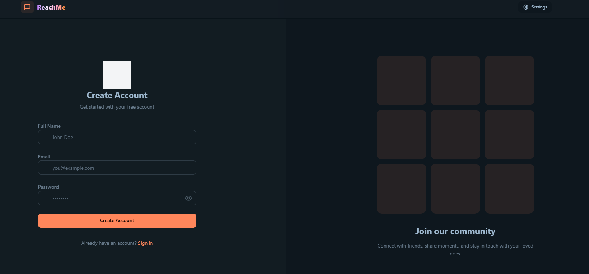

# Reach Me Messenger

  
[](https://render.com)

**Reach Me Messenger** is a secure, real-time chat application designed for seamless instant messaging and media sharing. Built with the MERN stack and WebSocket technology, it offers a dynamic user experience with robust security, customizable themes, and cloud-based image storage. Ideal for both personal and professional communication, the app ensures messages are delivered instantly while prioritizing user privacy and data protection.

---

## ✨ Key Features

- **Secure Authentication**: JWT-based login/logout with encrypted token storage.
- **Real-Time Messaging**: Instant message delivery using Socket.io.
- **Image Sharing**: Upload and send images stored securely on Cloudinary.
- **Dynamic UI**: 32 customizable theme modes powered by Tailwind CSS and DaisyUI.
- **Active User Tracking**: Real-time display of online/offline users.
- **Profile Management**: Add or update profile pictures with Cloudinary integration.
- **State Management**: Efficient global state handling using Zustand.
- **Responsive Design**: Optimized for all screen sizes.

---

## 🛠️ Tech Stack

### **Frontend:**

  
  
  


### **Backend:**

  


### **Database & Storage:**

  


### **Real-Time:**


---

## 🚀 Prerequisites

- **Node.js** (v18 or higher)
- **MongoDB Atlas** account (for database)
- **Cloudinary** account (for image storage)
- **Git** (for cloning the repository)

---

## 📥 Installation

### 1. Clone the Repository

```bash
git clone https://github.com/SudheeshTD/ReachMe.git
cd ReachMe
```

### 2. Install Dependencies & Build

Run the following command from the root directory:

```bash
npm run build
```

This command:

- Installs frontend (`/frontend`) and backend (`/backend`) dependencies.
- Builds the React app into the `/frontend/dist` folder for production.

### 3. Configure Environment Variables

Navigate to `/backend` and rename `example.env` to `.env`.
Update the following variables in `/backend/.env`:

```env
MONGODB_URI=your_mongodb_atlas_uri
PORT=5001
JWT_SECRET=your_jwt_secret_key
CLOUDINARY_CLOUD_NAME=your_cloudinary_cloud_name
CLOUDINARY_API_KEY=your_cloudinary_api_key
CLOUDINARY_API_SECRET=your_cloudinary_api_secret
```

---

## 🖥️ Running Locally

### Start the Backend Server:

```bash
npm start
```

The backend runs on `http://localhost:5001`.

### Access the Frontend:

The React app is served by the Express server after building. Open `http://localhost:5001` in your browser.



---

## ⚙️ Configuration Guides

### MongoDB Atlas Setup

1. Create a free cluster on **MongoDB Atlas**.
2. Under **Security > Network Access**, whitelist your IP address.
3. Under **Security > Database Access**, create a database user.
4. Replace `MONGODB_URI` in `.env` with your Atlas connection string.

### Cloudinary Setup

1. Sign up for a free **Cloudinary** account.
2. From the dashboard, note your:
   - **Cloud Name**
   - **API Key**
   - **API Secret**
3. Add these values to `/backend/.env`.

---

## 🌐 Deployment on Render

1. Create a **New Web Service** on Render and link your GitHub repository.
2. Configure settings:
   - **Build Command**: `npm run build`
   - **Start Command**: `npm start`
3. Add environment variables in Render’s dashboard:

```env
MONGODB_URI=your_mongodb_atlas_uri
JWT_SECRET=your_jwt_secret_key
CLOUDINARY_CLOUD_NAME=your_cloudinary_cloud_name
CLOUDINARY_API_KEY=your_cloudinary_api_key
CLOUDINARY_API_SECRET=your_cloudinary_api_secret
NODE_ENV=production
```

4. Deploy!

---

## 📂 Repository Structure

```bash
ReachMe/
├── backend/               # Express.js server
│   ├── src/               # Controllers, models, routes, and middleware
│   ├── .env               # Environment variables (sensitive)
│   └── package.json       # Backend dependencies
├── frontend/              # React (Vite) app
│   ├── src/               # Components, pages, Zustand store
│   └── dist/              # Production build (auto-generated)
├── .gitignore
└── package.json           # Root scripts for build/deployment
```

---

## 🚨 Troubleshooting

- **Port Conflicts**: Ensure ports `5001` (backend) and `5173` (frontend dev) are free.
- **Missing .env File**: Confirm `.env` exists in `/backend` with all variables.
- **CORS Errors**: Verify `cors()` middleware in Express allows your frontend origin.
- **Image Upload Failures**: Double-check Cloudinary API keys and cloud name.
- **JWT Errors**: Ensure the `JWT_SECRET` is a strong, unique string.

---

## 📄 License

Distributed under the **MIT License**. See [LICENSE](LICENSE) for details.

---

## 📬 Contact

**Developer**: Sudheesh Thuralkalmakki Dharmappa Gowda  
**GitHub**: [SudheeshTD](https://github.com/SudheeshTD)  
**Email**: [sudheeshtgowda@gmail.com]
